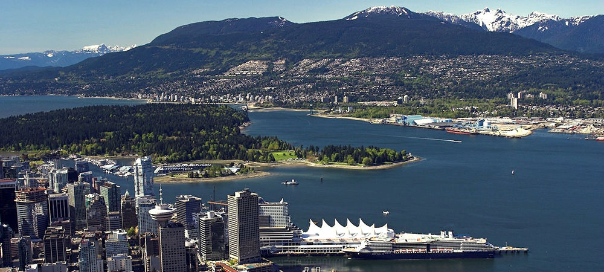
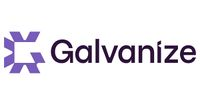

---

layout: col-sidebar
title: OWASP Vancouver
tags: pastevents-tag participation-tag sponsorship-tag
level: 0

region: North America
meetup-group: OWASP-Vancouver-Chapter
country: Canada
postal-code: 

---

## Welcome
Welcome to the OWASP
[Vancouver](https://en.wikipedia.org/wiki/Vancouver) chapter home page.
We are located in the beautiful province of [British
Columbia](https://en.wikipedia.org/wiki/British_Columbia), on the West
Coast of [Canada](https://en.wikipedia.org/wiki/Canada).

Our mission is to enrich Vancouver's application security community. We
hope you can join us in accomplishing that.

## Events

Our monthly sessions take place on the 4th Thursday of each month. We
also host one off events and workshops around town.

Have a look at [our calendar of awesome
events](https://www.meetup.com/OWASP-Vancouver-Chapter/) and join us\!

Presentations from some of our past events can be found in the **Past Events** section above.
<!-- links to tabs, like [Past Events](#div-pastevents) are not working at the moment (28 Jan 2020) -->

## Watch Online

**Subscribe** to the [OWASP Vancouver YouTube
channel](https://www.youtube.com/channel/UCSXBb_cPvieNm-MoLjjtbXw)
where you can check out live streams of upcoming sessions as well as
archives of previous sessions (big thanks to **George Pajari** and
volunteers).

## Slack Channel

Join the conversation in [#owasp-vancouver](https://mars-comm.slack.com/archives/C6QHGPUAK) channel on [MARS Slack](https://fourthplanet.ca/slack/).

## Our 2019 Supporters

We would like to thank the following companies for providing us with
space, pizza and pop, and helping us with our mission to enrich
Vancouver's application security community.

<table class="sponsors-table">
    <tr>
        <td>  </td>
        <td>  </td>
        <td>  </td>
    </tr>
    <tr>
        <td>  </td>
        <td>  </td>
        <td> <a href="https://www.cmd.com/"> _cmd" title=">_cmd"/> </a> </td>
    </tr>
</table>
