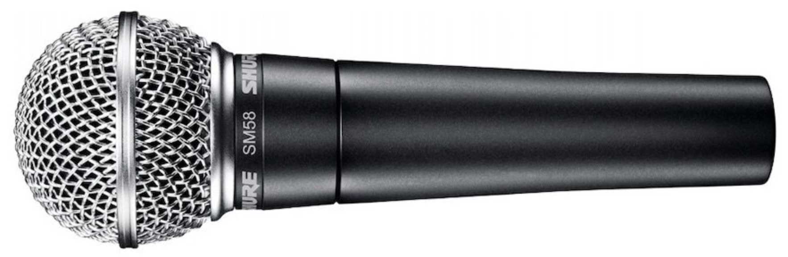
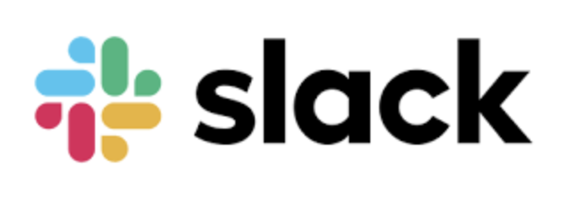
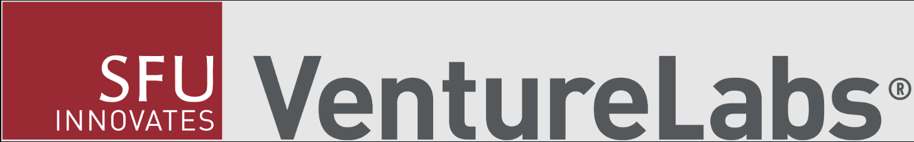
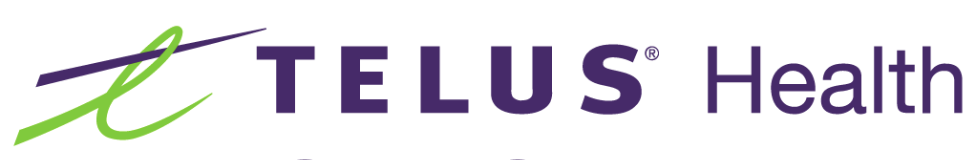
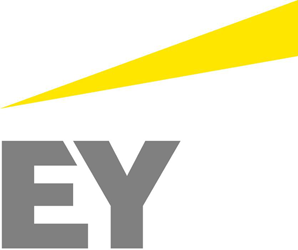
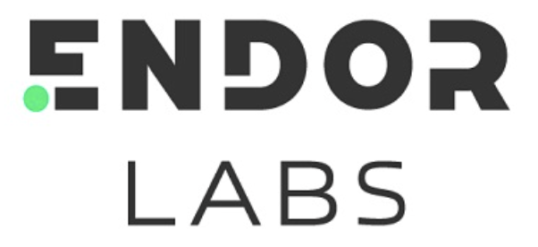
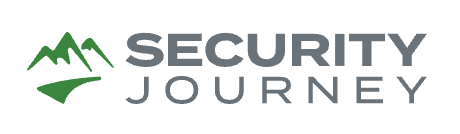
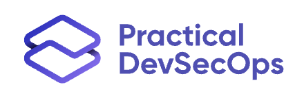
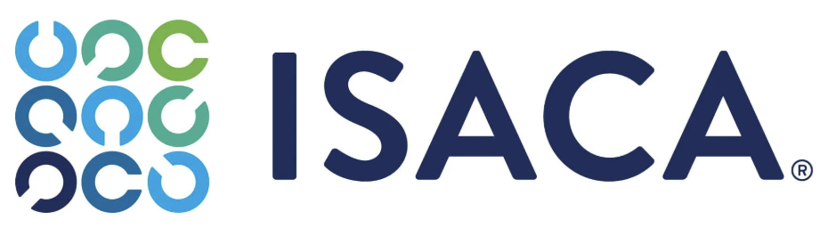
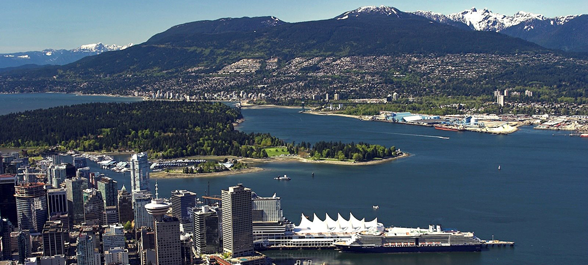

---

layout: col-sidebar
title: OWASP Vancouver
tags: events-tag pastevents-tag participation-tag sponsorship-tag
level: 0

region: North America
meetup-group: OWASP-Vancouver-Chapter
country: Canada
postal-code: 

---

## Welcome

Welcome to the OWASP
[Vancouver](https://en.wikipedia.org/wiki/Vancouver) chapter home page.
We are located in the beautiful province of [British
Columbia](https://en.wikipedia.org/wiki/British_Columbia), on the West
Coast of [Canada](https://en.wikipedia.org/wiki/Canada).

Our mission is to enrich Vancouver's application security community. We
hope you can join us in accomplishing that.

<table class="content-table">
  <tr>
    <td class="text-column">
      <h3>Upcoming meetings on Meetup</h3>
      
Check out our <a href="https://www.meetup.com/owasp-vancouver-chapter">meetings on Meetup</a> and come along to learn and connect with other local security folk - we'd love to meet you!

    </td>
    <td class="image-column">
      
    </td>
  </tr>
  <tr>
    <td class="text-column">
      <h3>Share your knowledge as a Speaker</h3>
      
We're always looking for speakers for our meetings, so whether you have a 5 minute or hour-long talk, let us know by sharing the details via our Speaker form: <a href="https://forms.gle/thuaQHMzxumG6Wxy6">https://forms.gle/thuaQHMzxumG6Wxy6</a>

    </td>
    <td class="image-column">
      
    </td>
  </tr>
  <tr>
    <td class="text-column">
      <h3>Join our Slack Channel</h3>
      
Join the conversation in our <a href="https://mars-comm.slack.com/archives/C6QHGPUAK">#owasp-vancouver</a> channel on the MARS Community Slack Workspace! If you're not already there, <a href="https://join.slack.com/t/mars-comm/shared_invite/zt-2e5n00d34-q9tsNfKS_XrtEDWFpRTxKQ">click here to join</a>.

    </td>
    <td class="image-column">
      
    </td>
  </tr>
  <tr>
    <td class="text-column">
      <h3>Connect with our LinkedIn Group</h3>
      
Learn about our upcoming meetings and other news in our LinkedIn Group: <a href="https://www.linkedin.com/groups/14485841/">https://www.linkedin.com/groups/14485841/</a>

    </td>
    <td class="image-column">
      
    </td>
  </tr>
</table>

## Our 2025 Supporters

We would like to thank the following companies for providing us with
space, pizza and pop, and helping us with our mission to enrich
Vancouver's application security community.

<table class="sponsors-table">
    <tr>
        <td>  </td>
        <td>  </td>
        <td>  </td>
        <td>  </td>
    </tr>
    <tr>
        <td>  </td>
        <td>  </td>
        <td>  </td>
        <td>  </td>
    </tr>
    <tr>
        <td>  </td>
        <td></td>
        <td></td>
        <td></td>
    </tr>
</table>

