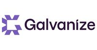

## Sponsorship

As a [501(c)(3)](/about) non-profit professional
association your support and sponsorship of any meeting venue and/or
refreshments is tax-deductible. Financial contributions should only be
made online using the authorized online chapter donation button.

[Donate](/donate) to this chapter or become a local chapter supporter.

## Our 2019 Sponsors

We would like to thank the following companies for providing us with
space, pizza and pop, and helping us with our mission to enrich
Vancouver's application security community.

<table class="sponsors-table">
    <tr>
        <td>  </td>
        <td>  </td>
        <td>  </td>
    </tr>
    <tr>
        <td>  </td>
        <td>  </td>
        <td> <a href="https://www.cmd.com/"> _cmd" title=">_cmd"/> </a> </td>
    </tr>
</table>